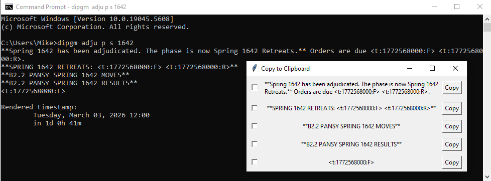

# DipGM
A CLI tool to generate text for use in adjudication games of Diplomacy over Discord.

## Use
Clone this repository: 
- `git clone https://github.com/mheidal/diplomacy-gm-text`

Optionally, install this project as a Python module:
- `cd diplomacy-gm-text`
- `pip install .`

This will allow you to invoke the CLI tool from your command line anywhere using the module name `dipgm`.

Alternatively, invoke the CLI tool directly:
- `py diplomacy-gm-text/dipgm/cli.py`

This guide will assume you have installed the module.

Create a new game: 
- `dipgm create-game "Game Name" [-t adjudication time, 24h clock, e.g. "13:30:] [-z reference adjudication timezone, e.g. "America/Los Angeles"] [-n nicknames, any number of strings which function as references to this game]`

Adjudicate:
- `dipgm adju game_name phase year`
- - `game_name`: The name of the game, or a nickname referring to that game.
- - `phase`: Any of `s`, `sr`, `f`, `fr`, `w` (for spring, spring retreats, etc)
- - `year`: Current year of the game

Example use:
- `dipgm create-game "B2.2 Pansy" -t 09:00 -z "America/New York" -n p`
- `dipgm adju p s 1642`

Output: 
```
**Spring 1642 has been adjudicated. The phase is now Spring 1642 Retreats.** Orders are due <t:1772568000:F> <t:1772568000:R>.
**SPRING 1642 RETREATS: <t:1772568000:F> <t:1772568000:R>**
**B2.2 PANSY SPRING 1642 MOVES**
**B2.2 PANSY SPRING 1642 RESULTS**
<t:1772568000:F>

Rendered timestamp:
        Tuesday, March 03, 2026 12:00
        in 1d 0h 41m
```

